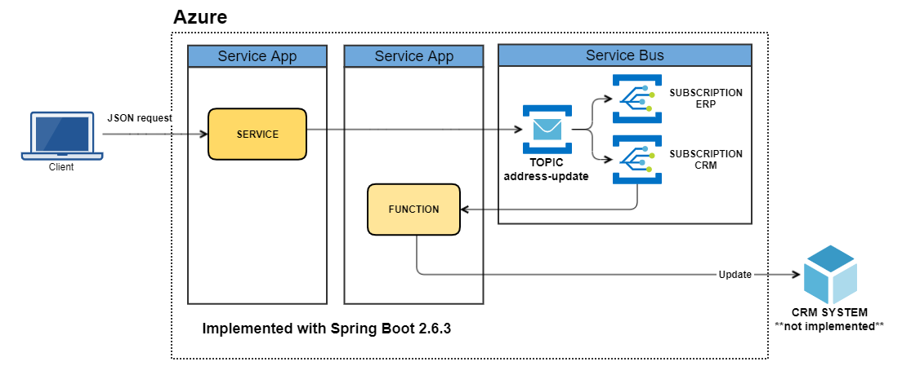

# azure-servicebus-customerupdate
*This project shows how to implement an architecture where a Java Spring Boot Service sends messages to a topic with multiple subscriptions in Azure Service Bus, and then processing with Java Azure Functions*

> Documentation in progress........

## Table of contents
1. [Introduction](#introduction)
2. [Prerequisites](#prerequisites)
3. [Environment variables](#environment-variables)
4. [Build and test the application](#build-and-test-the-application)
5. [Recommended content](#recommended-content)

## Introduction
The project shows a complete demo where we have Spring Boot components that sends and receives messages to/from Azure Service Bus. The initial point is a microservice created with Spring Boot which receives the customer update data through an exposed rest endpoint. A service component is responsible of emitting messages to Azure Service Bus using the library azure-spring-boot-starter-servicebus-jms. The messages arrive at a Topic, which has two subscriptions, one of them is used to update the data in a hypothetical CRM. There is a function created with Azure Functions framework and Spring Boot that subscribes to the subscription and receives the messages. The function is supposed to handle the update in the CRM system and acknowledge the received message in Service Bus. Next the architecture diagram:

## Prerequisites
* An Azure subscription.
* Java Development Kit (JDK) 11.
* Apache Maven, version 3.8 or later.
* An Azure Cosmos DB account.

## Environment variables
The Sensitive data was removed from the application configuration. The next
environment variables must be configured with the proper values:
* AZURE_COSMOS_DATABASE. The name of the Azure Cosmos DB account.
* AZURE_COSMOS_URI. URI value for the Azure Cosmos DB account.
* AZURE_COSMOS_KEY. Primary key for the Azure Cosmos DB account.

The data can be retrieved from Azure portal, selecting the Cosmos DB account,
example:

# Build and test the application

Build your Spring Boot application with Maven and run it; for example:
~~~bash
mvn spring-boot:run

....
....
[INFO] --- spring-boot-maven-plugin:2.6.3:run (default-cli) @ azure-cosmosdb-eventlog ---
[INFO] Attaching agents: []

  .   ____          _            __ _ _
 /\\ / ___'_ __ _ _(_)_ __  __ _ \ \ \ \
( ( )\___ | '_ | '_| | '_ \/ _` | \ \ \ \
 \\/  ___)| |_)| | | | | || (_| |  ) ) ) )
  '  |____| .__|_| |_|_| |_\__, | / / / /
 =========|_|==============|___/=/_/_/_/
 :: Spring Boot ::                (v2.6.3)

2022-02-24 16:33:06.210  INFO 7496 --- [           main] com.demo.messagelog.MainApplication      : Starting MainApplication using Java 11.0.11 on CAD1VR2ITP20146 with PID 7496 (Z:\projects\apps\MessageLogging\github\azure-cosmosdb-eventlog\target\classes started by a803669 in Z:\projects\apps\MessageLogging\github\azure-cosmosdb-eventlog)
2022-02-24 16:33:06.215  INFO 7496 --- [           main] com.demo.messagelog.MainApplication      : The following profiles are active: local
2022-02-24 16:33:07.180  INFO 7496 --- [           main] .s.d.r.c.RepositoryConfigurationDelegate : Bootstrapping Spring Data cosmos repositories in DEFAULT mode.
2022-02-24 16:33:07.273  INFO 7496 --- [           main] .s.d.r.c.RepositoryConfigurationDelegate : Finished Spring Data repository scanning in 88 ms. Found 1 cosmos repository interfaces.
2022-02-24 16:33:07.283  INFO 7496 --- [           main] .s.d.r.c.RepositoryConfigurationDelegate : Bootstrapping Spring Data cosmos repositories in DEFAULT mode.
2022-02-24 16:33:07.288  INFO 7496 --- [           main] .s.d.r.c.RepositoryConfigurationDelegate : Finished Spring Data repository scanning in 3 ms. Found 0 cosmos repository interfaces.
2022-02-24 16:33:12.193  INFO 7496 --- [           main] o.s.b.web.embedded.netty.NettyWebServer  : Netty started on port 8082
2022-02-24 16:33:12.203  INFO 7496 --- [           main] com.demo.messagelog.MainApplication      : Started MainApplication in 6.803 seconds (JVM running for 8.205)
~~~

Once your application is running, you can use CURL to test it, for example
(using line continuation character for windows):
~~~bash
curl --location --request POST 'http://localhost:8082/events' ^
--header 'Content-Type: application/json' ^
--data-raw '{
  "event" : "published",
  "messageId" : "ca4c80cd-69d4-4d2a-856e-b61da41d27f7:1:1:1-1",
  "correlationId" : "df1dc146-c455-4489-bf9c-9332889373b1:2:1:1-1",
  "queueTopic" : "CustomerUpdate",
  "subscription" : "updateOnMainDB",
  "message" : "ewogICJtZXNzYWdlRGF0YSIgOiB7CiAgICAibWVzc2FnZUlkIiA6ICI2ODFlNzc2ZS1kOTI2LTRiNDMtOWNjMS1lYWQyMDUyNjYyOGYiLAogICAgIm1lc3NhZ2VDb3JyZWxhdGlvbklkIiA6IG51bGwsCiAgICAibWVzc2FnZVR5cGUiIDogIlBob25lVXBkYXRlIiwKICAgICJtZXNzYWdlVHlwZVZlcnNpb24iIDogIjEiLAogICAgIm1lc3NhZ2VEYXRlVGltZSIgOiAiMjAyMS0xMS0xMlQxMDowMDowMi43NTk5MTg2IiwKICAgICJtZXNzYWdlU2VuZGVyQ29kZVJlcG9zaXRvcnkiIDogIkNvZGVSZXBvc2l0b3J5TmFtZSIsCiAgICAibWVzc2FnZVNlbmRlckNvbW1pdElkIiA6ICI1YWY0MjA1IiwKICAgICJtZXNzYWdlU2VuZGVyQnVpbGRWZXJzaW9uIiA6ICIxLjAuMTgiLAogICAgIm1lc3NhZ2VTZW5kZXJCdWlsZFRpbWUiIDogIjIwMjEtMTAtMTFUMTU6NTQ6MjQtMDYwMCIsCiAgICAibWVzc2FnZUZpbHRlclBhcmFtZXRlcjEiIDogbnVsbCwKICAgICJtZXNzYWdlRmlsdGVyUGFyYW1ldGVyMiIgOiBudWxsLAogICAgIm1lc3NhZ2VGaWx0ZXJQYXJhbWV0ZXIzIiA6IG51bGwKICB9LAogICJhY2NvdW50SWQiIDogIjEyMzQ1NiIsCiAgInBob25lQXJlYUNvZGUiIDogIjY1MSIsCiAgInBob25lTnVtYmVyIiA6ICIxMjM0NTY3IiwKICAicGhvbmVFeHRlbnNpb24iIDogIjkiLAogICJwaG9uZVR5cGUiIDogIk1vYmlsZSIsCiAgInBob25lQ29uZmlybWF0aW9uU3RhdHVzQ29kZSIgOiAiQiIKfQ==",
  "success": true,
  "error": ""
}'
~~~

## Recommended content
* [How to use the Spring Boot Starter for Azure Service Bus JMS](https://docs.microsoft.com/en-us/azure/developer/java/spring-framework/configure-spring-boot-starter-java-app-with-azure-service-bus)
* [Use the Java Message Service with Azure Service Bus and AMQP 1.0](https://docs.microsoft.com/en-us/azure/service-bus-messaging/service-bus-java-how-to-use-jms-api-amqp)
* [Work with Azure Functions Core Tools](https://docs.microsoft.com/en-us/azure/azure-functions/functions-run-local?tabs=v4%2Cwindows%2Ccsharp%2Cportal%2Cbash)
* [Azure Functions Java developer guide](https://docs.microsoft.com/en-us/azure/azure-functions/functions-reference-java?tabs=bash%2Cconsumption#bindings)
* [Azure Service Bus trigger for Azure Functions](https://docs.microsoft.com/en-us/azure/azure-functions/functions-bindings-service-bus-trigger?tabs=java)
* [Code and test Azure Functions locally](https://docs.microsoft.com/en-us/azure/azure-functions/functions-develop-local#local-settings-file)
